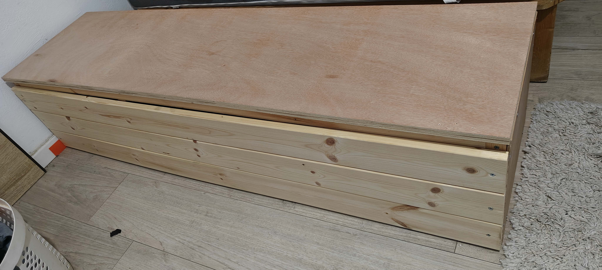
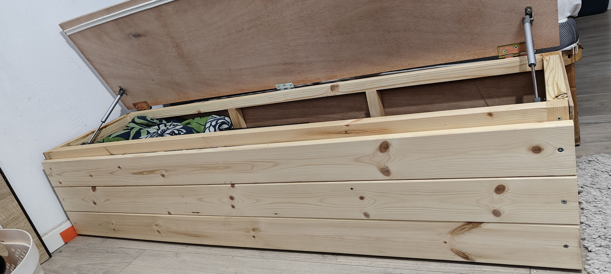

Wooden Storage Bench

DIY wooden storage bench designed in Tinkercad and assembled by hand ✋ 

- Hinged plywood lid
- Internal wooden frame
- Storage space inside
- Designed to support sitting

Tinkercad design:
https://www.tinkercad.com/things/gDZGs5nSU03-hadom/edit

Status:
Assembled 

